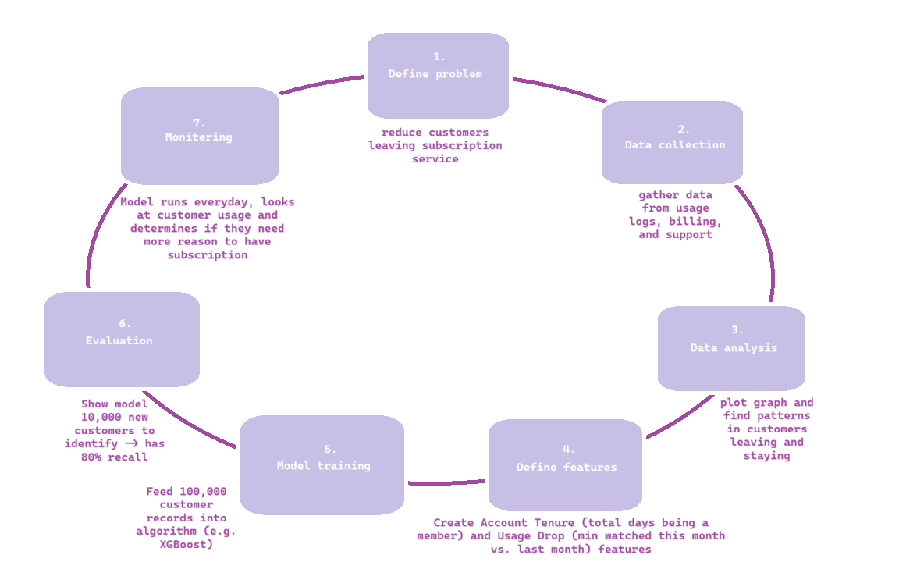

# dtsc330_26

# HW 2

How do you fill in the missing dates from the grants data?
    - Made loop to look at range of missing dates
        ○ Rows 65925-70459
    - Trouble finding pattern
        ○ Out of order
    - Decided to use the average date for NaNs
        ○ Looked for last dates entered between NaNs and filled in midpoint date

PI_NAMEs contains multiple names. We can only connect individual people. Can you make it so that we can get "grantees"?
Split PI_NAMES into different rows using pandas
    - Clean pi names
        ○ Remove (contact)
        ○ Get rid of whitespace
        ○ Determine delimiters
    - Split pi names into list of individual names
        ○ Used explode() to create one row per investigator
    - Removed empty/missing entries and retained application ID between each person and their grant
    - Create normalized grantees table with one person per row

The dates for Articles are problematic. Can you fix them?
    - Look at how dates are formatted
    - Determine what tag we're parsing
        ○ PubDate vs. others
    - If PubDate tag: extra loop
        ○ If tags are month, day, year: save into variable
Format into year-month-day

# HW 3
- Read in har (first 10 participants) and reusable classifier files
- Converted the timestamp data into a timeseries so that I could resample the data
- Determined unique participants
- For each person, computed acceleration magnitude using acc_x, acc_y, acc_y
- Resampled into 10 or 60 second intervals
- Determined features (acc_mag) and labels (is_sleep)
- Used first participants as test set and remaining in training set
- After loop, read in classifier using random forest model type
- Train features and labels
- Predict test features
- Print out accuracy
- 60s: 0.5862884160756501
- 10s: 0.6007462686567164

# HW 4
After implementing XGBoost to my reusable classifier, these are the new accuracies:
10s: 
Correct: 1484 / 2412
Accuracy: 0.615257048092869

60s:
Correct: 242 / 423
Accuracy: 0.5721040189125296
The 10s interval became slightly more accurate and the 60s interval became slightly less accurate.

# HW 8

Entity resolution is the process of linking different data sources that refer to the same person or thing. For example, John Smith is listed on one database and Jonathan Smith is listed on the other. If John and Jonathan were the same person, then entity resolution would link both records together.
- Week 1: we talked about examples of LLMs and companies that use LLMs, such as ChatGPT and Spotify, on Spotify, there are often multiple versions of the same song (single vs. album vs. deluxe album), entity resolution would aggregate all total streams for all version to determine its position on the charts.
- Week 2: we started looking at the article vs. grants data, entity resolution would link the article authors with grantees
- Week 3: we read in the HAR data to look at sleep classification, we read in heartrate, motion, and labels and applied it to an ID that represents one person
- Week 4: we looked at classifiers such as XGBoost, determine separate entities based on how they are classified
- Week 5: we looked at fasttext, gives each word a vector (like an ID), if two words have a similar meaning, then their vectors would be linked
- Week 6: when you create training data, you have to train on examples - J. Smith and John Smith are the same person, Jane Doe and John Smith are not
- Week 7: used SQL, created a bridge table for HW, linked articles and grants table using primary key
- Week 8: talked about what happens when multiple data points are linked (not just one to one), use graphs to map out data points, determine if two nodes are connected or not, a node can be connected to more than one other node

# HW 9
https://teachablemachine.withgoogle.com/models/QDxN2a7Kc/

For my neural network, I uploaded various pictures of cats and humans. I only uploaded about 4 photos for each and it was able to recognize either almost 100% accurately. I also then showed it photos of a human holding a cat, which it was also able to detect both in one photo. However, if there was neither in the camera, it wouldn't understand and think both might be there. I think this classifier works so well with few training images because it has already been trained to recognize specific shapes, I only conducted the final rule of what to exactly look for.

# HW 12
This week, we used an email dataset and I created a classifier that would determine if an email was spam. First, I tried comparing has_suspicious_link column with the labels column and didn't find any correlation. Next, I looked at the unique values in the subject column and recorded words that seemed to be spam. I did the same process with the email_text column and gathered a few more key words. I looped through the dataset to note the columns that had these key words in either their subject or body. I used the reusable_classifier from earlier this semester to run an XGBoost test. My classifier has an accuracy of 0.9985.